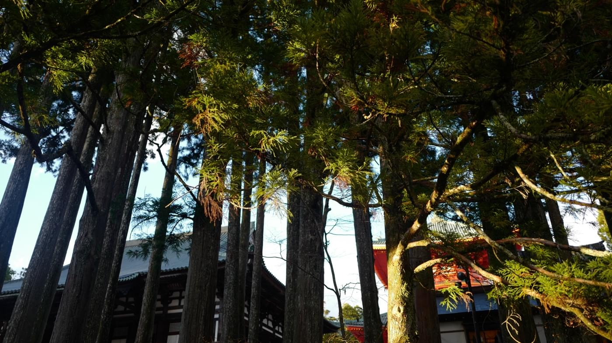

# Hi!

Hi I'm **Freyyj** (or Freyja, or Frey, or Frey·ja as you like) part-time girl and part-time writer on technology, culture, and social platforms.

You can find me online at [**freyyj.org**](https://freyyj.org) and on Twitter at [**@freyyj**](https://twitter.com/freyyj).

---

I write as often as I can make myself do it. Here's my latest.

( 🖥️ = technology, 🌏 = social platforms/internet, 🎞️ = culture, 💄 = boy-to-girl stuff, 📓 = personal, 🗞️ = other )

* 🎞️  [**The Original Uniform**](https://freyyj.org/star-trek-uniform) <em>Nov 1, 2020</em>

    An ode to the incredibly cute women's uniforms in _Star Trek_'s original series, which coincidentally is also my Halloween costume this year.

* 🖥️  [**Testing for Google Description Regression**](https://freyyj.org/google-description-regression) <em>Oct 29, 2020</em>

    Optimizing for the exact number of characters Google will show in a description and implementing a regression test to make sure the limit is never exceeded.

* 📓  [**A Note on Chat Requests**](https://freyyj.org/chat-requests) <em>Oct 29, 2020</em>

    I almost never respond to chat requests on social platforms. That might feel like a slight, so here's an explanation as to why."

A full list of [my articles is here](https://freyyj.org/articles).

---

